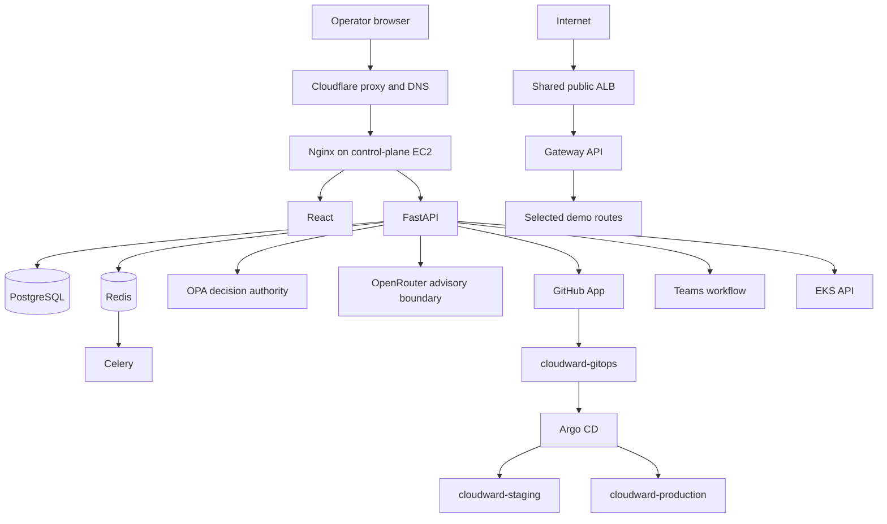
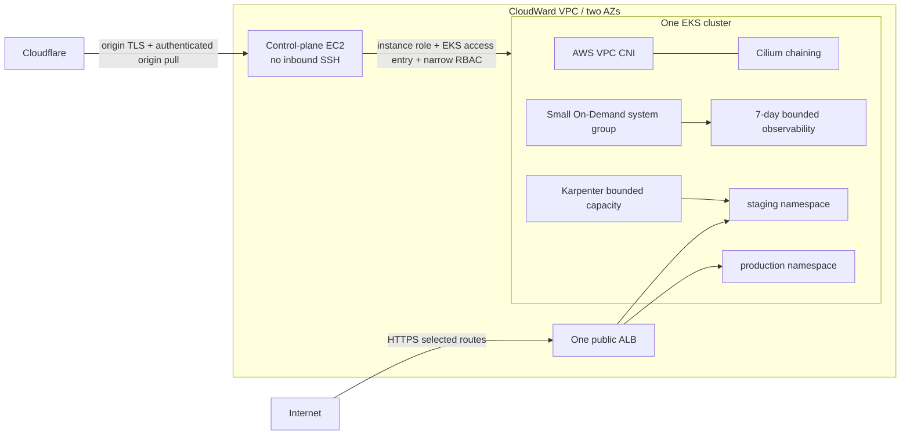
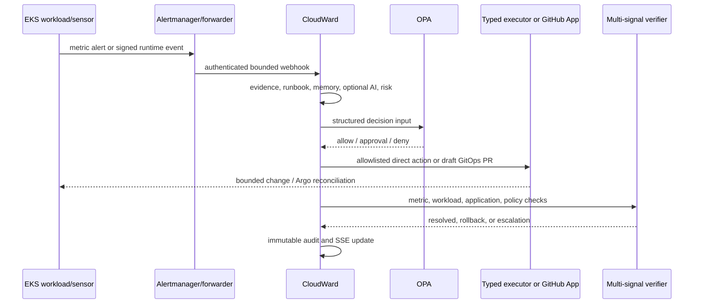

# AWS architecture (Part 4)

Status: repository design prepared; no AWS resource or real deployment is claimed by this document.

CloudWard keeps the Part 1–3 decision path and moves only the runtime boundary to AWS. The public control plane is a deliberately small, single-EC2 Docker Compose deployment. One EKS cluster contains separate staging and production namespaces. Terraform owns AWS infrastructure and platform prerequisites; Argo CD owns Kubernetes workloads after bootstrap.



## AWS network and compute

The target region is centralized as `eu-north-1`. The VPC spans two Availability Zones. The design deliberately avoids a NAT Gateway for the ephemeral portfolio environment; that choice reduces fixed hourly cost but is not presented as an enterprise reference topology. Worker exposure is controlled by security groups, node IAM, Kubernetes policy, and tightly restricted EKS endpoint CIDRs. No security group permits all ports from `0.0.0.0/0`, and SSH is not an operating dependency.

The EKS data plane retains AWS VPC CNI. Cilium runs in AWS-CNI chaining mode for network policy and quarantine, which is distinct from full-CNI Cilium in local k3d. A small On-Demand managed node group carries bootstrap and essential controllers. Karpenter uses bounded current `NodePool`/`EC2NodeClass` resources: critical capacity is On-Demand; stateless demo capacity prefers Spot with On-Demand fallback. PostgreSQL and the CloudWard control plane never rely on Spot-only capacity.



## Identity and trust boundaries

- Humans authenticate with GitHub OAuth; FastAPI enforces Viewer, Operator, and Admin roles.
- GitHub Actions uses short-lived OIDC sessions. Planning and applying use separate IAM roles. The apply role is reachable only through a protected GitHub Environment with required reviewers.
- EC2 uses an instance profile and an EKS access entry mapped to dedicated Kubernetes RBAC. The API/worker production images use AWS CLI v2 as the kubeconfig exec helper. IMDSv2 remains required; hop limit two permits the bridged trusted containers and is documented as an SSRF-sensitive tradeoff. Static AWS keys are not accepted as deployment design.
- Kubernetes controllers use narrowly scoped workload identity roles where AWS access is needed.
- GitHub writes use the installed GitHub App, repository and path allowlists, draft PRs, and no merge permission.
- Cloudflare terminates browser TLS; Nginx also requires TLS and authenticated origin pulls. The EC2 security group must admit 443 only from current Cloudflare address ranges.

## Policy architecture

OPA and Kyverno address different boundaries. OPA makes the final CloudWard remediation decision from incident, risk, target, action, and approval facts. Kyverno controls Kubernetes admission, including digest and signature requirements. Cilium enforces network policy and reversible quarantine. Tetragon observes bounded runtime behavior. None substitutes for IAM or Kubernetes RBAC.

AI remains outside the authority path:

```text
untrusted evidence -> redact/bound -> optional AI diagnosis -> allowlisted candidate
                                                        |
deterministic evidence + runbook -> risk -> OPA -> approval -> typed executor
                                                        -> verify -> learn/audit
```

## Event, remediation, security, and FinOps flows



Reliability may use a reversible direct action for transient recovery or a GitOps PR for persistent configuration. Security containment is a narrowly scoped Cilium policy, verified by failed prohibited traffic and retained service health. FinOps combines observed Prometheus utilization and OpenCost allocation; it creates a recommendation and reviewable staging PR, never an automatic production resize.

## GitOps and CI/CD

CI gates source, policies, Helm, Trivy findings, SBOM production, keyless Cosign signing, and immutable digest publication. Staging consumes the signed digest through GitOps. Production changes only through a promotion PR and human merge. Terraform does not become the workload deployer.

Terraform pull requests run format, validation, TFLint, Trivy IaC, and a read-only plan. The apply workflow is manual, main-only, requires exact typed confirmation, recreates a plan, and pauses at a protected GitHub Environment before applying that exact checksummed artifact. There is no automated destroy workflow.

## Observability

Prometheus, Alertmanager, Grafana, Loki, Tempo, OpenTelemetry, and OpenCost run with explicit resource requests and seven-day retention. They provide evidence but are not treated as an infallible source. Telemetry timeouts, missing samples, stale windows, and provider outages remain visible limitations rather than fabricated success.
